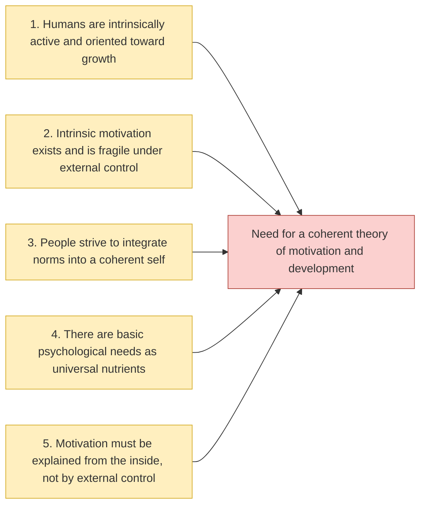
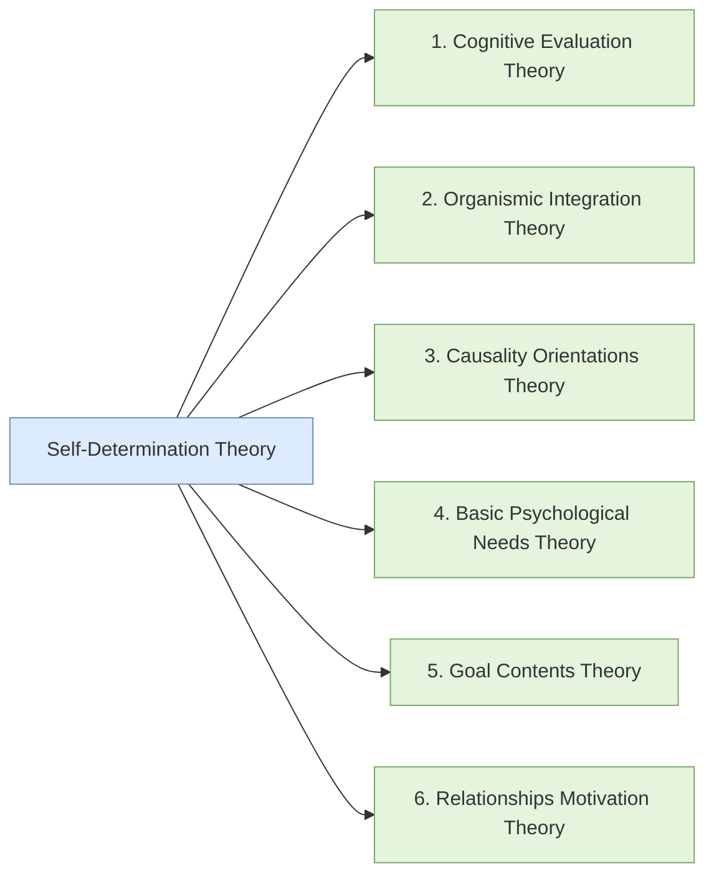

*These are my personal study notes on Ryan & Deci (2017), Self-Determination Theory: Basic Psychological Needs in Motivation, Development, and Wellness. Any errors or simplifications are my own, and this summary is not a substitute for the original book.*

## Block 1: Foundations and necessity of SDT (Ch. 1-5)

Block 1 introduces the organismic foundations of SDT and argues that humans are naturally active, growth-oriented, and socially embedded. It reviews historical and philosophical ideas about organization, autonomy, and psychological needs, and contrasts them with more mechanistic, external control-focused views. Across these chapters, Ryan and Deci motivate the need for a theory that explains how inner tendencies toward curiosity, integration, and well-being depend on specific features of social contexts.

1. **Humans are intrinsically active and oriented toward growth.** SDT starts from an organismic assumption that people are not passive responders to stimuli but have inherent tendencies toward exploration, mastery, and integration of experience. Under supportive conditions, these tendencies drive learning, creativity, and increasing psychological complexity.

2. **Intrinsic motivation exists and is fragile under external control.** The early empirical work reviewed in Block 1 shows that people often engage in activities out of interest and enjoyment, without external rewards or pressures. However, certain forms of control, surveillance, and contingent rewards can undermine this intrinsic motivation, making behavior more alienated and less self-sustaining.

3. **People strive to integrate norms into a coherent self.** Beyond spontaneous interest, humans have a basic inclination to internalize social norms and values so that they become personally endorsed rather than merely obeyed. This process of organismic integration is central to healthy self-development and requires conditions that support reflection, choice, and coherence rather than mere compliance.

4. **There are basic psychological needs as universal nutrients.** To explain when growth, intrinsic motivation, and integration flourish or break down, SDT posits three basic psychological needs: autonomy, competence, and relatedness. These needs function like universal psychological nutrients; when they are satisfied, people show vitality and well-being, and when they are chronically thwarted, they show ill-being and fragmentation.

5. **Motivation must be explained from the inside, not by external control.** Taken together, these ideas justify a shift from viewing motivation as something produced by external contingencies to viewing it as structured by how people experience their own reasons for acting. A viable theory of motivation must therefore focus on the quality of motivation — especially the felt autonomy or control of action — and on how social contexts support or undermine these inner motivational processes.

## Block 2: Mini-theories (Ch. 6-12)

Block 2 brings SDT from general assumptions about human nature to six specific mini-theories that structure its account of motivation, development, and relationships. Ryan and Deci show how different types of motivation, needs, goals, and relationship processes can be systematically understood rather than treated as loose “factors.” This block therefore functions as the theoretical core of the framework, translating the organismic starting points from Block 1 into precise propositions that can guide research and intervention in many applied domains.

1. **Cognitive Evaluation Theory (CET)** explains how *external events* (rewards, feedback, surveillance, deadlines) change *intrinsic motivation* by affecting *perceived autonomy and competence*. Predicts that *controlling events* and *ego-involving* climates undermine intrinsic motivation, whereas informational, *competence-supportive feedback* and *choice* enhance it.

2. **Organismic Integration Theory (OIT)** describes how *extrinsic motivation* becomes more autonomous through *internalization* and *integration* of social regulations. Differentiates *external, introjected, identified, and integrated regulation* along a *continuum of autonomy*, and links each type to distinct patterns of persistence and *well-being*.

3. **Causality Orientations Theory (COT)** proposes three relatively stable motivational orientations: autonomy, controlled, and impersonal. Shows that these orientations bias how people interpret situations (as supporting choice, control, or helplessness) and thereby shape typical patterns of motivation and adjustment.

4. **Basic Psychological Needs Theory (BPNT)** argues that *autonomy, competence, and relatedness* are *basic psychological nutrients* required for wellness, vitality, and full functioning. Links *need satisfaction* to thriving and *need frustration* to ill-being, defensive motivation, and psychopathology *across cultures and life domains*.

5. **Goal Contents Theory (GCT)** distinguishes *intrinsic life goals* (growth, relationships, community) from *extrinsic ones* (wealth, fame, image). Shows that *intrinsic goals support basic need satisfaction and well-being*, whereas *extrinsic goals tend to undermine them*, even when people succeed at those goals.

6. **Relationships Motivation Theory (RMT)** focuses on how autonomy, competence, and especially relatedness operate within close relationships and groups. Argues that *high-quality relationships require both emotional warmth and autonomy support*, and that *conditional regard or control damages relatedness and personal integration.*

[jekyll-docs]: https://jekyllrb.com/docs/home
[jekyll-gh]:   https://github.com/jekyll/jekyll
[jekyll-talk]: https://talk.jekyllrb.com/
